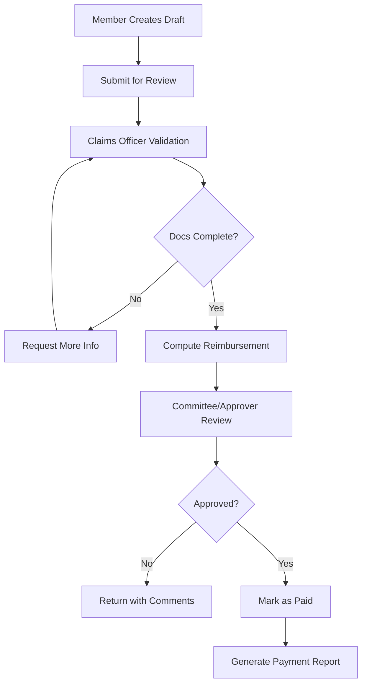

# SGSS Portal — Medical Fund Management System

A comprehensive medical fund management platform for managing members, claims, reimbursements, and fund administration. Built with React, TypeScript, and Supabase.

---

## Table of Contents

- Overview
- Features
- Tech Stack
- Prerequisites
- Getting Started
- Environment Variables
- Database Architecture
- Security
- Project Structure
- Roles & Permissions
- Reimbursement Framework
- Claims Workflow
- Scripts
- Testing
- Deployment
- Contributing
- License
- Support
- Acknowledgments
- Appendix A — Local Developer Guide

---

## Overview

The SGSS Portal streamlines the medical claims lifecycle—from member submission to review, approval, and reimbursement—while enforcing fund bylaws, role-based access, and auditability. It is designed for security, scalability, and ease of use for both members and administrators.

---

## Features

### Member Management

- Multi-tier membership: Life, Patron, Vice Patron, Family, Joint, Single
- NHIF number capture/validation and tracking
- Editable profiles with photo uploads
- Membership validity and status tracking
- Member dashboard with claim history

### Claims Processing

- Supported claim types: Outpatient, Emergency Services (extendable)
- Status workflow: Draft → Submitted → Processed → Approved → Paid
- Automated reimbursement calculations based on bylaws/configured limits
- Secure document uploads (receipts, medical files)
- Notes, comments, and change history
- Bulk processing tools for admins/claims officers

### Administration & Security

- Role-Based Access Control (RBAC): Member, Claims Officer, Committee, Approver, Trustee, Admin
- Configurable rules: reimbursement tiers, annual caps, eligibility windows
- Real-time analytics and downloadable reports
- Full audit logging for compliance
- Row-Level Security (RLS) on data access

### Technical Capabilities

- Real-time sync via Supabase
- PDF export (claims, receipts, reports)
- Responsive, mobile-first UI
- Type-safe end-to-end (TypeScript)
- PWA-ready (optional)

---

## Tech Stack

- Frontend: React 18, TypeScript, Vite, Tailwind CSS, Lucide React
- Backend: Supabase (PostgreSQL, Auth, Storage, Edge Functions)
- State/Data: Zustand, React Query
- Forms/Validation: React Hook Form, Zod
- Utilities: date-fns, jsPDF

---

## Prerequisites

- Node.js v18+
- npm v8+ or Yarn v1.22+
- Git (latest)
- Supabase account (and optionally Supabase CLI for local dev)

---

## Getting Started

1. Clone repository

```bash
git clone https://github.com/Jabrahamjohn/Sgssportal.git
cd Sgssportal
```

2. Install dependencies

```bash
npm install
# or
yarn install
```

3. Configure environment  
   Create a .env file in the project root (see Environment Variables).

4. (Optional) Local database with Supabase

```bash
npm install -g @supabase/cli
npx supabase init
npx supabase start
npx supabase db push
# optional seed/reset
npx supabase db reset --seed
```

5. Run the development server

```bash
npm run dev
```

Open http://localhost:5173

---

## Environment Variables

Create a .env file in the project root:

```env
VITE_SUPABASE_URL=your_supabase_project_url
VITE_SUPABASE_ANON_KEY=your_supabase_anon_key
```

Production build:

```env
VITE_SUPABASE_URL=your_production_supabase_url
VITE_SUPABASE_ANON_KEY=your_production_supabase_anon_key
VITE_APP_ENV=production
```

---

## Database Architecture

| Table            | Description                                 |
| ---------------- | ------------------------------------------- |
| users            | Basic user info and role mapping (via Auth) |
| roles            | Role definitions for RBAC                   |
| members          | Linked member profiles                      |
| membership_types | Membership categories and limits            |
| claims           | Claim records and processing status         |
| claim_items      | Detailed line items per claim               |
| chronic_requests | Chronic illness/medication tracking         |
| settings         | Fund rules, tiers, reimbursement scales     |
| notifications    | Alerts, system messages, claim updates      |
| audit_logs       | Historical user activity and system events  |

Notes:

- RLS policies enforce row-level access based on role and ownership.
- Settings drive reimbursement tiers, caps, and coverage percentages.

---

## Security

- Supabase Auth (email/magic link)
- Row-Level Security (RLS) policies on sensitive tables
- Principle of least privilege via RBAC
- Audit logs for system traceability
- Secure file storage for medical documents

---

## Project Structure

```
src/
├─ components/
│  ├─ admin/
│  ├─ auth/
│  ├─ claims/
│  ├─ layout/
│  ├─ members/
│  ├─ system/
│  └─ ui/
├─ hooks/
├─ pages/
├─ services/         # supabase client, domain services (auth, claims, members)
├─ types/            # app and database types
├─ utils/            # calculations, validation, formatting
└─ styles/
```

---

## Roles & Permissions

| Role           | Description            | Key Permissions                                              |
| -------------- | ---------------------- | ------------------------------------------------------------ |
| Member         | Registered fund member | Submit claims, upload documents, view history/profile        |
| Claims Officer | Processor              | Validate docs, compute reimbursements, move claims to review |
| Committee      | Reviewer               | Review processed claims, add notes/recommendations           |
| Approver       | Final approval         | Approve/decline claims, override with reasons                |
| Trustee        | Oversight              | View analytics/reports, approve policy and limit changes     |
| Admin          | System administrator   | Full access, user/role management, settings, audits          |

---

## Reimbursement Framework

- Tiers (configurable in Settings): Minor, Medium, Major, Regional, Special
- Coverage: Clinic vs External provider coverage percentages (configurable)
- Annual caps: Per-member/year caps and category caps (configurable)
- Chronic care: Managed via dedicated allocations/policies (if enabled)

Example (illustrative; actual values come from Settings):
| Tier | Coverage Example | Notes |
|----------|------------------|----------------------------------------|
| Minor | up to 100% | Consultations, basic medications |
| Medium | up to 100% | Diagnostics, minor procedures |
| Major | up to 100% | Surgeries, specialist interventions |
| Regional | up to 80% | Specialized/advanced procedures |
| Special | up to 80% | Emergency/ICU |

---

## Claims Workflow



---

## Scripts

Common npm scripts:

- npm run dev — Start dev server
- npm run build — Production build
- npm run preview — Preview production build
- npm run lint — Lint the codebase
- npm run test — Run unit tests (if configured)

Supabase CLI:

- npx supabase db push — Apply migrations
- npx supabase db reset — Drop/recreate/seed database
- npx supabase start / stop — Start/stop local Supabase

---

## Testing

```bash
# Run all tests
npm run test

# Optional if configured:
npm run test:watch
npm run test:coverage
```

Guidelines:

- Prefer unit tests for calculations/validation utils
- Add integration tests for claim workflows and permissions
- Mock Supabase calls where possible

---

## Deployment

### Vercel (recommended)

```bash
npm install -g vercel
vercel --prod
```

Set environment variables in Vercel Project Settings:

- VITE_SUPABASE_URL
- VITE_SUPABASE_ANON_KEY

### Netlify

```bash
npm run build
# Deploy the dist/ directory
```

### Docker

```dockerfile
FROM node:18-alpine
WORKDIR /app
COPY package*.json ./
RUN npm ci --only=production
COPY dist ./dist
EXPOSE 3000
CMD ["npx", "serve", "-s", "dist", "-l", "3000"]
```

---

## Contributing

1. Fork the repository
2. Create a feature branch: git checkout -b feature/your-feature
3. Install and run: npm install && npm run dev
4. Add tests and documentation where applicable
5. Commit with clear messages
6. Open a Pull Request

Coding standards:

- TypeScript strictness preferred
- Keep components small and typed
- Reuse UI components and hooks
- Update README when adding features

---

## License

MIT License. See the LICENSE file for details.

---

## Support

- Issues: https://github.com/Jabrahamjohn/Sgssportal/issues
- Discussions: https://github.com/Jabrahamjohn/Sgssportal/discussions

---

## Acknowledgments

- Built for the SGSS Medical Fund community
- Powered by Supabase and modern web tooling

---

Last Updated: 2025-10-17
