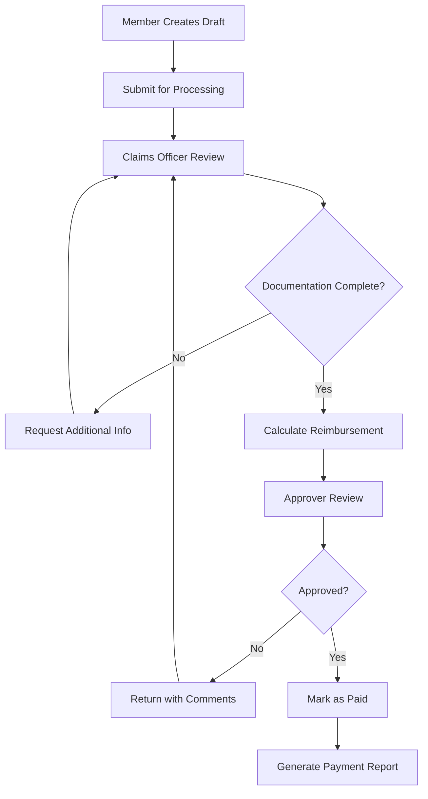

# SGSS Portal - Medical Fund Management System

A comprehensive medical fund management system built with React, TypeScript, and Supabase for managing members, claims, and reimbursements.

## 🌟 Overview

The SGSS Portal is a modern, full-featured medical fund management system designed to streamline the entire claims process from submission to payment. Built with cutting-edge technologies, it provides a secure, scalable, and user-friendly platform for managing medical reimbursements.

## ✨ Key Features

### 👥 Member Management

- **Multi-tier Membership**: Life, Patron, Vice Patron, Family, Joint, Single memberships
- **NHIF Integration**: Seamless NHIF number validation and tracking
- **Profile Management**: Comprehensive member profiles with photo uploads
- **Membership Validation**: Automated validity period tracking

### 📋 Claims Processing

- **Multiple Claim Types**:
  - Outpatient treatments
  - Inpatient procedures
  - Chronic illness management
  - Emergency services
- **Smart Status Tracking**: Draft → Submitted → Processed → Approved → Paid
- **Automated Calculations**: Real-time reimbursement calculation based on fund bylaws
- **Document Management**: Secure receipt and medical document uploads
- **Bulk Processing**: Handle multiple claims efficiently

### 🔐 Administration & Security

- **Role-Based Access Control**: 5-tier permission system
- **Advanced Settings**: Configurable reimbursement scales and limits
- **Comprehensive Reporting**: Real-time analytics and financial reports
- **Audit Trail**: Complete activity logging and compliance tracking
- **Data Security**: Row-level security with Supabase

### ⚡ Technical Excellence

- **Real-time Updates**: Live data synchronization across all users
- **PDF Generation**: Professional claims and reports export
- **Responsive Design**: Optimized for desktop, tablet, and mobile
- **Type Safety**: 100% TypeScript implementation
- **Progressive Web App**: Offline capabilities and app-like experience

## 🛠️ Technology Stack

### Frontend

- **React 18** - Modern React with hooks and concurrent features
- **TypeScript** - Full type safety and developer experience
- **Vite** - Lightning-fast build tool and dev server
- **Tailwind CSS** - Utility-first CSS framework
- **Lucide React** - Beautiful, customizable icons

### Backend & Database

- **Supabase** - Complete backend-as-a-service
  - PostgreSQL database with real-time subscriptions
  - Authentication and authorization
  - File storage and CDN
  - Edge functions

### State & Data Management

- **Zustand** - Lightweight state management
- **React Hook Form** - Performant forms with validation
- **Zod** - Schema validation and type inference
- **React Query** - Server state management

### Additional Libraries

- **React Router DOM** - Client-side routing
- **React Hot Toast** - Beautiful notifications
- **jsPDF** - PDF generation
- **Date-fns** - Date manipulation utilities

## 📋 Prerequisites

Before you begin, ensure you have the following installed:

- **Node.js** (v18.0.0 or later)
- **npm** (v8.0.0 or later) or **yarn** (v1.22.0 or later)
- **Git** (latest version)
- **Supabase Account** (free tier available)

## 🚀 Installation & Setup

### 1. Clone the Repository

```bash
git clone https://github.com/Jabrahamjohn/Sgssportal.git
cd Sgssportal
```

### 2. Install Dependencies

```bash
# Using npm
npm install

# Using yarn
yarn install
```

### 3. Environment Configuration

Create a `.env` file in the root directory:

```env
# Supabase Configuration
VITE_SUPABASE_URL=your_supabase_project_url
VITE_SUPABASE_ANON_KEY=your_supabase_anon_key

# Optional: Analytics and Monitoring
VITE_ANALYTICS_ID=your_analytics_id
VITE_SENTRY_DSN=your_sentry_dsn
```

### 4. Database Setup

#### Using Supabase CLI (Recommended)

```bash
# Install Supabase CLI
npm install -g @supabase/cli

# Initialize Supabase
npx supabase init

# Start local Supabase (optional for local development)
npx supabase start

# Apply database migrations
npx supabase db push

# Seed initial data
npx supabase db reset --seed
```

#### Manual Setup

1. Create a new project in [Supabase Dashboard](https://supabase.com/dashboard)
2. Copy the project URL and anon key to your `.env` file
3. Run the SQL scripts from `supabase/migrations/` in your Supabase SQL editor

### 5. Start Development Server

```bash
# Local development with Supabase local instance
npm run dev.local

# Development with Supabase cloud
npm run dev.cloud

# Default development mode
npm run dev
```

The application will be available at `http://localhost:5173`

## 🗄️ Database Architecture

### Core Tables

| Table              | Purpose                          | Key Features                            |
| ------------------ | -------------------------------- | --------------------------------------- |
| `users`            | Authentication & basic user info | Supabase Auth integration               |
| `roles`            | System permission levels         | RBAC implementation                     |
| `membership_types` | Membership categories & pricing  | Configurable membership tiers           |
| `members`          | Member profiles & medical info   | NHIF integration, validity tracking     |
| `claims`           | Medical claims & reimbursements  | Status workflow, automated calculations |
| `claim_items`      | Individual claim line items      | Detailed procedure tracking             |
| `chronic_requests` | Chronic illness applications     | Specialized workflow                    |
| `settings`         | System configuration             | Dynamic reimbursement rules             |

### Security Features

- **Row Level Security (RLS)**: Every table protected by role-based policies
- **Audit Logging**: Comprehensive activity tracking
- **Data Encryption**: All sensitive data encrypted at rest and in transit
- **API Rate Limiting**: Protection against abuse

## 📁 Project Structure

```
src/
├── components/              # Reusable UI components
│   ├── admin/              # Administrative interfaces
│   │   ├── MemberManagement.tsx
│   │   ├── SystemSettings.tsx
│   │   └── ReportsAnalytics.tsx
│   ├── auth/               # Authentication components
│   │   ├── LoginForm.tsx
│   │   └── ProtectedRoute.tsx
│   ├── claims/             # Claims processing UI
│   │   ├── ClaimForm.tsx
│   │   ├── ClaimsList.tsx
│   │   └── ClaimDetails.tsx
│   ├── layout/             # Application layout
│   │   ├── Header.tsx
│   │   ├── Sidebar.tsx
│   │   └── Footer.tsx
│   ├── members/            # Member management
│   │   ├── MemberProfile.tsx
│   │   └── MembershipCard.tsx
│   ├── system/             # System components
│   │   ├── LoadingSpinner.tsx
│   │   └── ErrorBoundary.tsx
│   └── ui/                 # Base UI components
│       ├── Button.tsx
│       ├── Modal.tsx
│       └── Table.tsx
├── contexts/               # React contexts
│   ├── AuthContext.tsx
│   └── ThemeContext.tsx
├── hooks/                  # Custom React hooks
│   ├── useAuth.ts
│   ├── useClaims.ts
│   └── useMembers.ts
├── pages/                  # Application pages
│   ├── admin/              # Admin dashboard
│   ├── auth/               # Authentication pages
│   ├── claims/             # Claims management
│   ├── dashboard/          # Main dashboard
│   └── members/            # Member pages
├── services/               # API and business logic
│   ├── supabase.ts
│   ├── auth.ts
│   ├── claims.ts
│   └── members.ts
├── types/                  # TypeScript definitions
│   ├── database.ts
│   ├── auth.ts
│   └── claims.ts
├── utils/                  # Utility functions
│   ├── calculations.ts
│   ├── validation.ts
│   └── formatting.ts
└── styles/                 # Global styles
    └── globals.css
```

## 🔧 Available Scripts

| Script       | Description                     | Usage                |
| ------------ | ------------------------------- | -------------------- |
| `dev.local`  | Development with local Supabase | `npm run dev.local`  |
| `dev.cloud`  | Development with Supabase cloud | `npm run dev.cloud`  |
| `dev`        | Default development mode        | `npm run dev`        |
| `build`      | Production build                | `npm run build`      |
| `preview`    | Preview production build        | `npm run preview`    |
| `lint`       | Run ESLint                      | `npm run lint`       |
| `type-check` | TypeScript type checking        | `npm run type-check` |
| `test`       | Run tests                       | `npm run test`       |

## 👥 User Roles & Permissions

### 🏥 Member

- ✅ View personal profile and membership details
- ✅ Submit new medical claims
- ✅ Track claim status and history
- ✅ Update personal information
- ✅ Download claim receipts and reports

### 📝 Claims Officer

- ✅ Process submitted claims
- ✅ Update claim statuses and add notes
- ✅ Validate claim documentation
- ✅ Calculate reimbursement amounts
- ✅ Generate processing reports

### ✅ Approver

- ✅ Review and approve processed claims
- ✅ Handle high-value claim approvals
- ✅ Generate approval reports
- ✅ Override system calculations when necessary

### 🏛️ Trustee

- ✅ Access comprehensive financial reports
- ✅ View system-wide analytics
- ✅ Approve policy and limit changes
- ✅ Monitor fund performance

### ⚙️ Administrator

- ✅ Complete system access and control
- ✅ User and role management
- ✅ System configuration and settings
- ✅ Database management and backups
- ✅ Security and audit management

## 💰 Reimbursement Framework

### Procedure Classification

| Tier         | Annual Limit | Coverage | Examples                            |
| ------------ | ------------ | -------- | ----------------------------------- |
| **Minor**    | ₦30,000      | 100%     | Consultations, basic medications    |
| **Medium**   | ₦35,000      | 100%     | Diagnostic tests, minor procedures  |
| **Major**    | ₦50,000      | 100%     | Surgeries, specialist treatments    |
| **Regional** | ₦90,000      | 80%      | Advanced procedures, long-term care |
| **Special**  | ₦70,000      | 80%      | Emergency services, intensive care  |

### Coverage Limits

- **Annual Member Limit**: ₦250,000
- **Critical Care Add-on**: ₦200,000 (additional)
- **Clinic Fund Coverage**: 100%
- **External Provider Coverage**: 80%
- **Chronic Illness**: Separate allocation
- **Emergency Override**: Trustee approval required

## 🔄 Claims Workflow



## 📊 Analytics & Reporting

### Member Analytics

- Enrollment trends and demographics
- Membership type distribution
- Activity and engagement metrics

### Claims Analytics

- Processing time analysis
- Approval rates by category
- Reimbursement trends
- Popular procedure types

### Financial Reports

- Fund balance and projections
- Monthly/quarterly statements
- Cost per member analysis
- Risk assessment reports

## 🧪 Testing

```bash
# Run all tests
npm run test

# Run tests in watch mode
npm run test:watch

# Run tests with coverage
npm run test:coverage

# Run specific test suite
npm run test -- --grep "Claims"
```

## 📦 Deployment

### Production Build

```bash
# Create production build
npm run build

# Test production build locally
npm run preview
```

### Deployment Options

#### Vercel (Recommended)

```bash
# Install Vercel CLI
npm install -g vercel

# Deploy
vercel --prod
```

#### Netlify

```bash
# Build and deploy
npm run build
# Upload dist folder to Netlify
```

#### Docker

```dockerfile
FROM node:18-alpine
WORKDIR /app
COPY package*.json ./
RUN npm ci --only=production
COPY dist ./dist
EXPOSE 3000
CMD ["npx", "serve", "-s", "dist", "-l", "3000"]
```

### Environment Variables (Production)

```env
VITE_SUPABASE_URL=your_production_supabase_url
VITE_SUPABASE_ANON_KEY=your_production_anon_key
VITE_APP_ENV=production
```

## 🤝 Contributing

We welcome contributions! Please follow these steps:

### Getting Started

1. **Fork** the repository
2. **Clone** your fork: `git clone https://github.com/yourusername/Sgssportal.git`
3. **Create** a feature branch: `git checkout -b feature/amazing-feature`
4. **Install** dependencies: `npm install`
5. **Start** development server: `npm run dev`

### Development Guidelines

- Follow TypeScript best practices
- Write meaningful commit messages
- Add tests for new features
- Update documentation as needed
- Follow the existing code style

### Pull Request Process

1. Update README if needed
2. Ensure all tests pass
3. Update version numbers if applicable
4. Create detailed PR description
5. Request review from maintainers

## 📄 License

This project is licensed under the **MIT License** - see the [LICENSE](LICENSE) file for details.

## 🆘 Support & Help

### Documentation

- 📚 [Wiki](https://github.com/Jabrahamjohn/Sgssportal/wiki)
- 🐛 [Issues](https://github.com/Jabrahamjohn/Sgssportal/issues)
- 💬 [Discussions](https://github.com/Jabrahamjohn/Sgssportal/discussions)

### Contact

- 📧 **Email**: support@sgssportal.com
- 🌐 **Website**: [sgssportal.com](https://sgssportal.com)
- 📱 **WhatsApp**: +234-xxx-xxx-xxxx

### FAQ

**Q: How do I reset my password?**
A: Use the "Forgot Password" link on the login page.

**Q: What file formats are supported for receipts?**
A: PDF, JPG, PNG, and JPEG files up to 5MB each.

**Q: How long does claim processing take?**
A: Typically 3-5 business days for standard claims.

## 🙏 Acknowledgments

- Built with ❤️ for the SGSS Medical Fund community
- Special thanks to all contributors and beta testers
- Powered by [Supabase](https://supabase.com) and [Vercel](https://vercel.com)

---

**Version**: 2.0.0 | **Last Updated**: October 2024 | **Status**: Active Development
